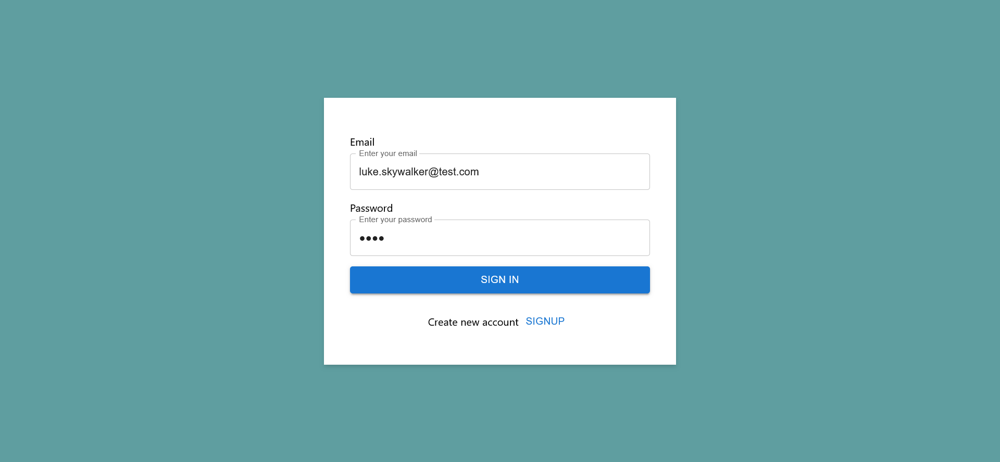
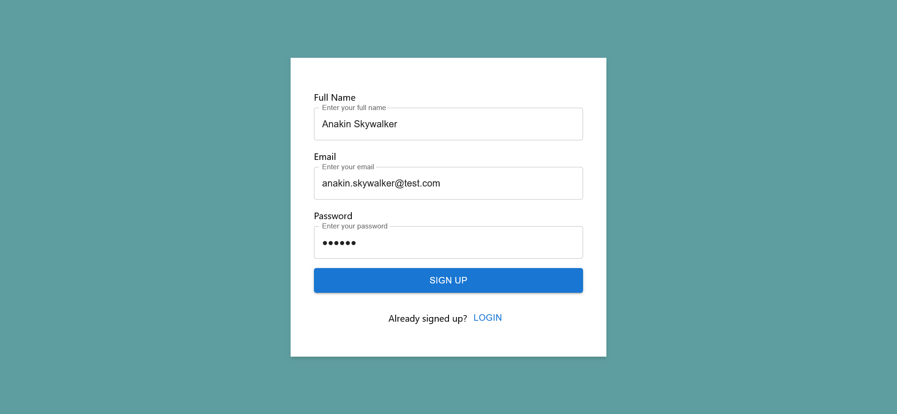

# Ứng dụng Chat

Chào mừng đến với Ứng dụng Chat của tôi! Dự án này là một ứng dụng nhắn tin thời gian thực với giao diện người dùng 
lấy cảm hứng từ WhatsApp. Nó cho phép người dùng trao đổi tin nhắn cá nhân hoặc trong nhóm.


## Tính năng

- **Nhắn tin thời gian thực:** Trải nghiệm nhắn tin mượt mà, thời gian thực với việc gửi tin nhắn tức thì.
- **Nhắn tin cá nhân:** Gửi tin nhắn riêng tư đến người dùng khác.
- **Nhắn tin nhóm:** Tạo và chỉnh sửa nhóm để giao tiếp với nhiều người dùng.
- **Đăng nhập và Đăng ký:** Truy cập ứng dụng an toàn với hệ thống đăng nhập và đăng ký.

## Công nghệ sử dụng

- **Frontend:** Typescript với React
- **Backend:** Java với Spring Boot, Spring Security, Spring Websocket và Spring Data JPA
- **Cơ sở dữ liệu:** PostgreSQL
- **Xác thực:** JSON Web Token (JWT)
- **Quản lý trạng thái:** Redux, Thunk
- **Thư viện Component:** Material UI

## Bắt đầu

### Yêu cầu

Đảm bảo bạn đã cài đặt **npm** và **mvn** trên máy tính của bạn.

### Cài đặt

1. **Clone repository:**  
    ```bash  
    git clone https://github.com/hiepau1231/chat-app2.git
    ```
   
2. **Di chuyển vào thư mục Frontend và cài đặt các dependencies:**  
    ```bash
    cd frontend
    npm install
    ```
   
3. **Di chuyển vào thư mục Backend và cài đặt các dependencies:**  
    ```bash
    cd backend
    mvn clean install
    ```
   
4. **Cấu hình biến môi trường:**  
   Cấu hình application.properties của Spring Boot cho database và các cấu hình khác.

5. **Chạy ứng dụng:**
    - Khởi động frontend:
      ```bash
      npm start
      ```
    - Khởi động backend:
      ```bash
      mvn spring-boot:run
      ```
6. **Truy cập ứng dụng:**
   - Mở trình duyệt và truy cập [http://localhost:3000](http://localhost:3000) để sử dụng ứng dụng Chat.
   - Bạn có thể đăng nhập với tài khoản mẫu để truy cập ứng dụng với dữ liệu có sẵn:
     - email: luke.skywalker@test.com
     - password: luke
   - Hoặc bạn có thể tạo tài khoản mới và bắt đầu chat!

## Hình ảnh

Xem các cuộc trò chuyện với người dùng khác:


Gửi tin nhắn cho người dùng khác:


Đăng nhập vào tài khoản:


Tạo tài khoản mới:


Bắt đầu cuộc trò chuyện mới:


Chỉnh sửa cuộc trò chuyện:


## Hướng dẫn đóng góp

Tôi rất hoan nghênh các đóng góp! Nếu bạn có ý tưởng cải thiện hoặc tính năng mới, hãy tạo issue hoặc gửi pull request.

## Giấy phép

Dự án này được cấp phép theo [Giấy phép MIT](LICENSE).

Cảm ơn bạn đã sử dụng và đóng góp cho Ứng dụng Chat Thời gian thực!
